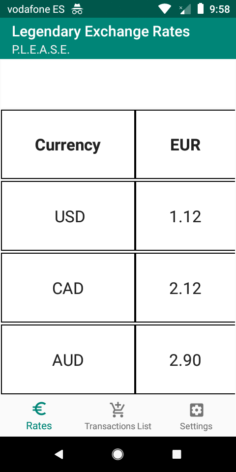
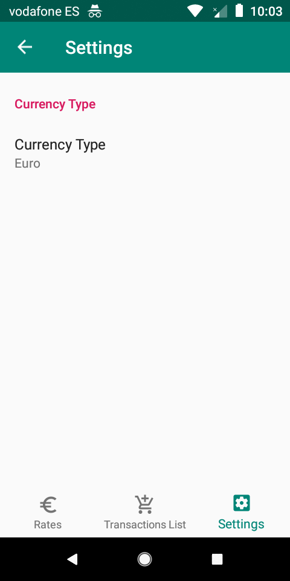
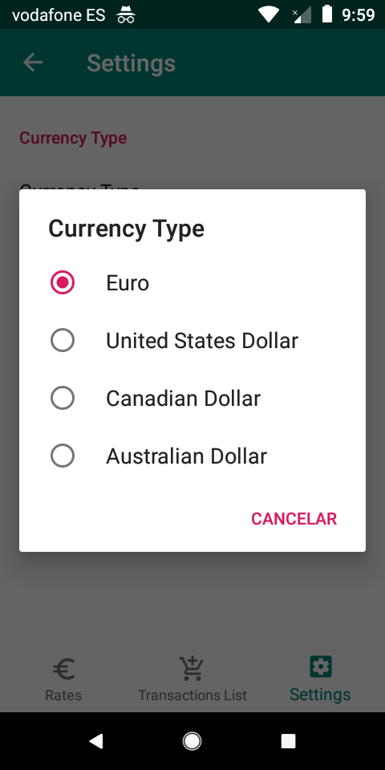
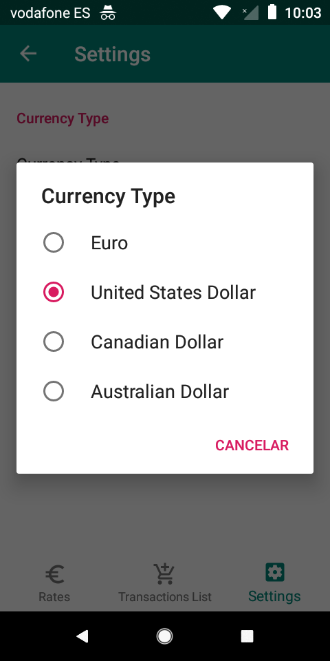
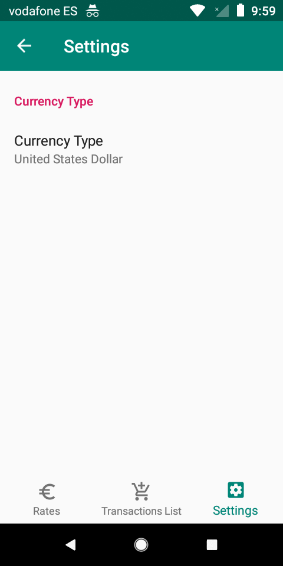
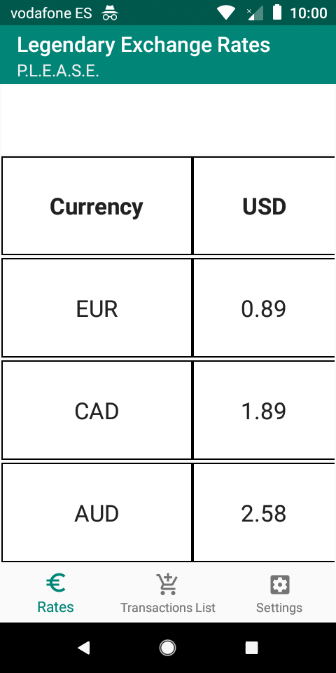
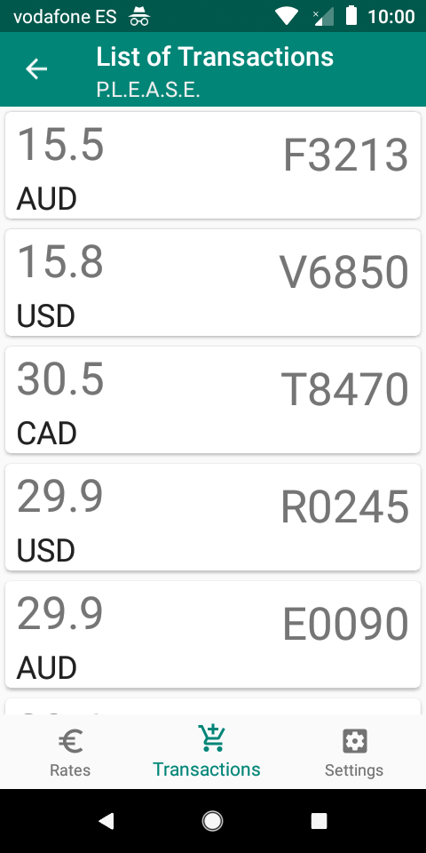
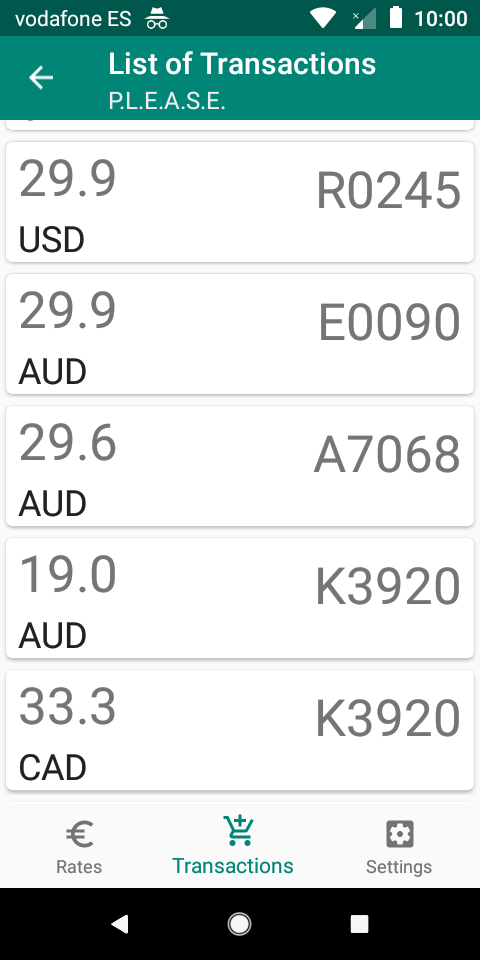
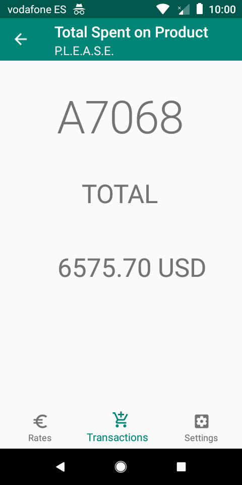
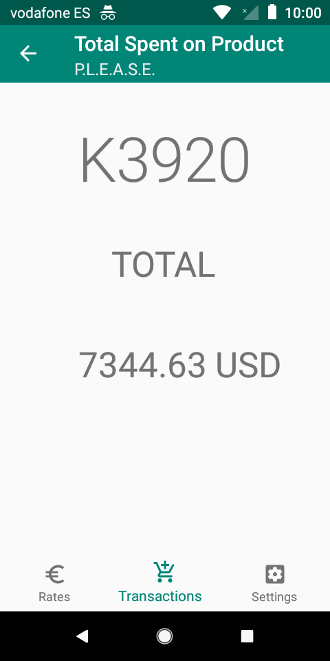

# P.L.E.A.S.E.
Provide Legal Exculpation And Sign Everything

The app follows the architecture MVVM, uses LiveData, Room, ViewModels, Kodein, Coroutines, Navigation, Retrofit, okHttp, GSON, Material Design, Preferences, threetenabp library of Jake Wharton which helps us with better date/time management and amitshekhar library for debugging the database in a browser. 

This app is called P.L.E.A.S.E. because it's the job position of our favourite banker Barney Stinson, who works in the Bank GNB

This is our first screen, where by default apears the rates values for Euros

This is our Settings Screen where we can choose which type of currency we want to see our Rates Conversion Table and also the currency we want to use to calculate the total of transactions of one type we are interested to see in our last screen.

Here we can see the Rates Conversion Table after setting up Dollar as the main currency

This is the Transactions Screen here we can see all the transactions we made in it's original currency.

It's a recyclerview so we can swipe it down

When we click in one of our Transactions, this last screen apears, which shows you the Transaction Sku and 
the total of transactions we made of that product in the Currency we set up in our Setting Screen.

